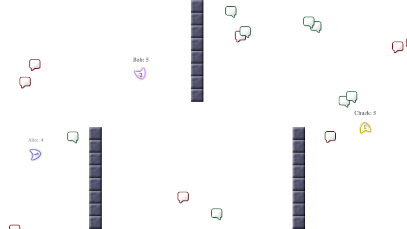

# Repman

Repman is a browser-based multiplayer game. Players join as little gliders who gain points by collecting green bubbles (positive reviews), but lose points if they collect a red bubble (negative review).

Repman was created as the base of a hackathon at [TrustYou](https://github.com/trustyou/) back in 2012. I have since updated the code to try out JavaScript features that came out in the meantime.



## Installation

Tested on Node 12, 14 & 16.

```shell
npm install
```

## Usage

```shell
npm start
```

… Then visit http://localhost:8888/index.html to join the game locally, or join from another machine on a public IP address.

To start on a different port, set the `PORT` environment variable.

## Development

### Lint & run tests

```shell
npm run lint_fix
npm test
```

### Overview of files

* [`Position`](src/position.js) and [`Rectangle`](src/rectangle.js) are geometric primitives
* [`engine.js`](src/engine.js) contains definitions of all game objects by composing behavior using [traits.js](https://www.npmjs.com/package/traits.js)
* [`Game`](src/game.js) defines the business logic of a game containing multiple players
* [`Server`](src/server.js) turns Repman into a multiplayer game by sending & receiving data over websockets
* … and [`main.js`](src/main.js) is the app entry point
